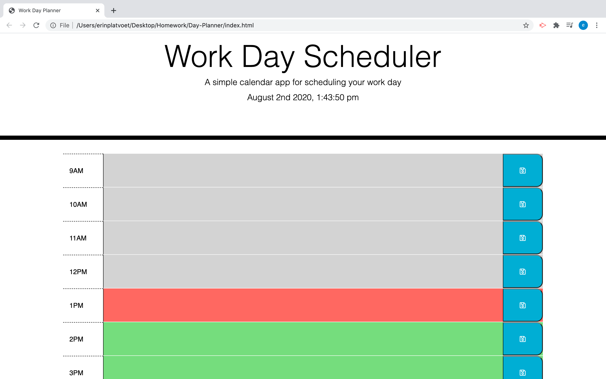

# Day-Planner

For this project, we needed to create a day planner that would allow the user to input tasks & save them to local storage so when the page refreshes, their tasks are still on the page. The timeblocks also needed to reflect whether that hour was in the past, present, or future.

## Technologies Used:

Activities from previous classes were helpful, as well as the weekend study review. I took a lot of information out of the review that not only allowed me to complete this assignment, but I understand it a lot more so I will be able to use it with confidence in the future. Live coding with classmates after class was also a huge help as well.\
https://learn.jquery.com/using-jquery-core/document-ready/\
https://momentjs.com/\

## Screenshot & Link:

https://eplatvoet.github.io/Day-Planner/\

